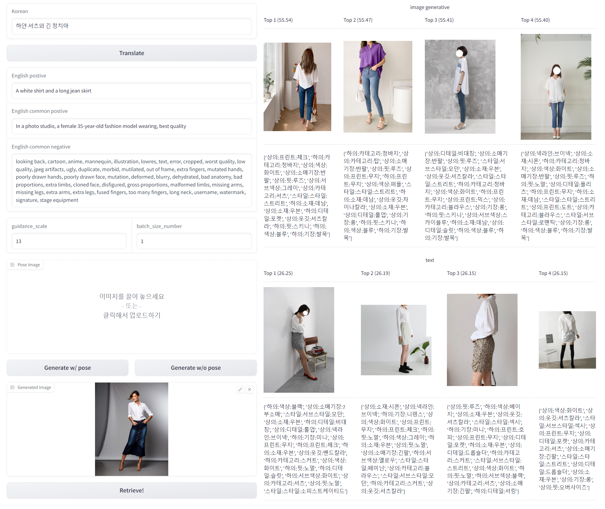

# Multi modal understanding model based on VL-KE-T5
이 저장소는 복합 대화를 위한 멀티 모달 이해 모델 version 2.0에대한 코드와 모델 및 데이터를 포함 합니다.
## Version history
### Version 1.0
복합 대화를 위한 멀티 모달 이해 모델을 VL-KE-T5을 기반으로 하여 학습하였습니다.
이해 모델의 성능을 보이기 위해, 패션 이미지의 representation과 패션 이미지에 대한 텍스트의 representation을 
정렬하도록 하고 텍스트가 주어졌을 때 관련 이미지를 검색하는 기능을 구현하였습니다.
이를 위해 공개 데이터인 kfashion dataset을 사용하였습니다.

단순한 텍스트에 대한 이미지는 잘 찾지만, 복잡하고 많은 속성을 표현한 텍스트가 주어졌을 때는 검색 성능이 떨어지는 한계가 있었습니다.

### Version 2.0 (현 repository 내용)
Version 1.0에서의 한계를 극복하고자 이미지 생성 기반 검색 기술을 제안하였습니다. Text encoder가 복잡한 텍스트의 representation을 잘 표현하지 못한다는 한계에 착안하여 image encoder만 사용하는 방식을 구상했습니다.

구체적으로, 텍스트가 주어지면 text-to-image diffusion model을 사용하여 이미지를 생성하고, image encoder로 representation을 구한 뒤 비슷한 representation의 다른 image를 검색하는 방식입니다.


## 필요 패키지 설치

```bash
    pip install torch
    conda install -c pytorch faiss-gpu # or faiss-cpu
    pip install transformers sentencepiece
```

faiss의 자세한 설차 방법은 [FAISS](https://github.com/facebookresearch/faiss/blob/main/INSTALL.md)를 참고하시길 바랍니다.

## 필요한 파일 다운로드

- [사전 학습된 멀티 모달 이해 모델](https://tmp)
- [kfashion fvecs 파일 패션이미지로 추출된 representation](https://tmp)
- [kfashion dataset의 tag 정보](https://tmp)

## 검색 기능 실행 방법

```bash
python text_generated_image_to_image_retriever/main_gradio_comparison.py
```

## 실행 화면



## Acknowledgement

본 연구는 정부(과학기술정보통신부)의 재원으로 지원을 받아 수행된 연구입니다. (정보통신기획평가원, 2022-0-00320), (정보통신기획평가원, 2022-0-00608), (정보통신기획평가원, 2021-0-00537), (정보통신산업진흥원, S0316-21-1002)

# TODO

- [ ] 생성된 image로 image encoder fine-tuning
- [ ] label 정보를 활용한 supervised training
- [ ] 정량적 검색 성능 평가